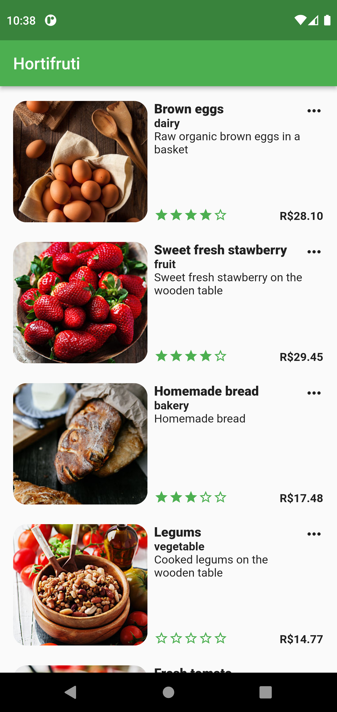
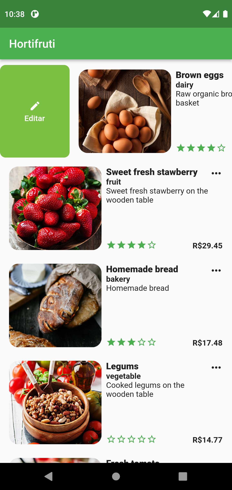
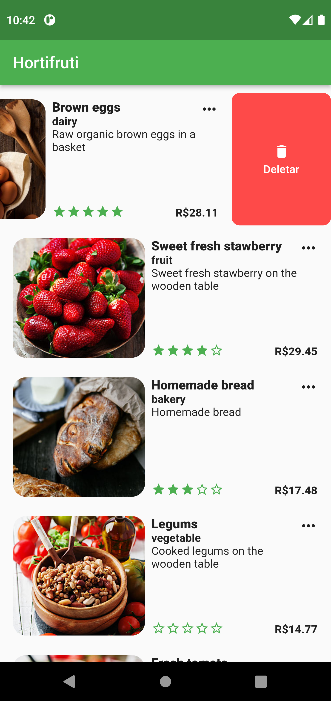
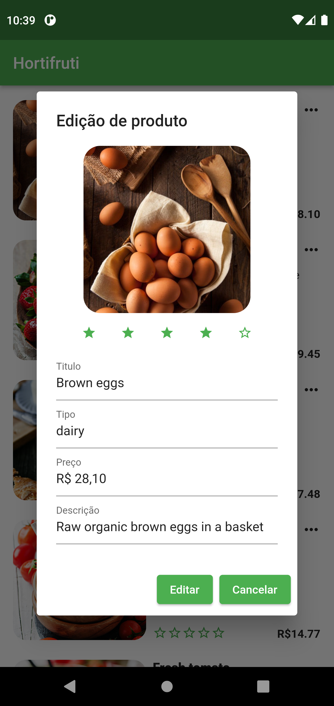

<h1 align="center">
  
    
  
  
  
</h1>

<h3 align="center">
  Aplicação Flutter - Flutter Challenge - Coodesh
</h3>

<p align="center">Aplicação de listagem, edição e remoção de produtos - Desafio da Coodesh</p>

<p align="center">
  <a href="#-sobre-o-projeto">Sobre o projeto</a>&nbsp;&nbsp;&nbsp;|&nbsp;&nbsp;&nbsp;
  <a href="#-tecnologias">Tecnologias</a>&nbsp;&nbsp;&nbsp;|&nbsp;&nbsp;&nbsp;
  <a href="#-como-utilizar">Como utilizar?</a>&nbsp;&nbsp;&nbsp;|&nbsp;&nbsp;&nbsp;
  <a href="#-license">Licença</a>
</p>

## 💻 Sobre o projeto

Flutter Challenge é uma aplicação desenvolvida para o Desafio da Coodesh, nesse desafio você deveria implementar um sistema de listagem de produtos utilizando Firestore ou Firebase Realtime DB, processando as imagens e o arquivo products.json que continham os dados para teste.
Esse sistema devia listar, editar e excluir os produtos utilizando ferramentas de injeção de dependencia (Modular), gerenciamento de estado (MOBX) e ferramentas de cache de imagem.
Além de ter alguns testes unitários para verificar se a listagem e remoção de produtos estava funcionando.

## 🚀 Tecnologias

Tecnologias utilizadas pra desenvolver o projeto:

- [Flutter](https://flutter.dev/)
- [Dart](https://dart.dev/)

### 💼 Packages importantes

Os packages utilizados para desenvolver o projeto:

- [flutter_modular](https://pub.dev/packages/flutter_modular)
- [mobx](https://pub.dev/packages/mobx)
- [path_provider](https://pub.dev/packages/path_provider)
- [firebase_core](https://pub.dev/packages/firebase_core)
- [cloud_firestore](https://pub.dev/packages/cloud_firestore)
- [firebase_storage](https://pub.dev/packages/firebase_storage)
- [mocktail](https://pub.dev/packages/mocktail)

## 🔥 Como instalar?

### Android

- Você pode instalar utilizando o seguinte link [Android](./github/versionAndroid.apk)

### Apple

- Para testar a versão apple é necessário buildar o código

## 🔥 Como utilizar?

### Requirements

- Você pode seguir com a instalação do Flutter [Flutter tutorial](https://docs.flutter.dev/get-started/install).

**Clone esse projeto e acesse a pasta destino**

```bash
$ git clone https://github.com/rod-moraes/flutter_challenge.git && cd flutter_challenge
```

**Siga os passos abaixo**

```bash
# Instale as dependências
$ flutter run
# Você pode abrir a aplicação no seu Emulador.
```

## 📝 License

This project is licensed under the MIT License - see the [LICENSE](LICENSE) file for details.

---

Feito com 💜 por Rodrigo Moraes
